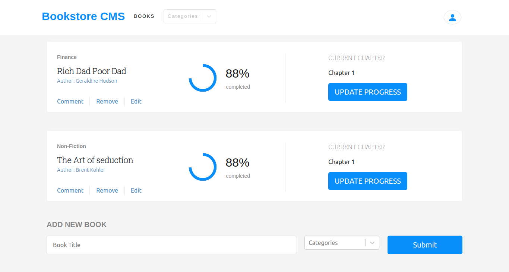

# Magic-Books with REDUX

Magic-books Inc. is a fictional company based in Germany. They have requested  me help to build the front-end of an application that will help them organize and manage their bookstore. They want it to be fast, dynamic and responsive to their actions and therefore I decided to build it with React & Redux.

## Screenshot


  
## Demo
Click here to view Live [Magic-books](https://tanzila-magic-books.herokuapp.com/).
## Run Locally

Clone the project

```bash
  git clone https://github.com/tanzila-abedin/bookstore.git
```

Install dependencies

```bash
  npm i
```

Start the server

```bash
  npm run start
```

👤 **Tanzila**


- GitHub: [@githubhandle](https://github.com/tanzila-abedin)
- Twitter: [@twitterhandle](https://twitter.com/TanzilaAbedin)
## 🤝 Contributing
Contributions, issues, and feature requests are welcome!

Feel free to check the [issues page](../../issues/).

## Show your support
Give a ⭐️ if you like this project!

## Acknowledgments
- Hat tip to anyone whose code was used
- Inspiration
- etc


